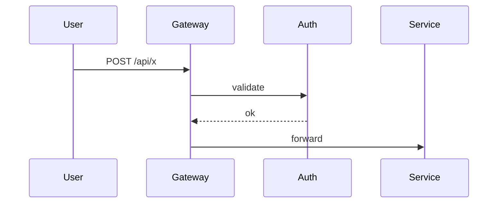

# Writing Operational Doc

Operational 문서 (GUIDE / SETUP / INSTALL / TROUBLESHOOTING) — Task-first.

## 1. Reference vs Operational 구분
| Reference | Operational |
|---|---|
| ARCHITECTURE / DESIGN / PROPOSAL | GUIDE / SETUP / INSTALL / TROUBLESHOOTING |
| Top-down (왜 → 어떻게) | Task-first (어떻게 → 왜) |
| `writing-design-doc` skill | 본 skill |

## 2. 메타데이터 헤더 (필수)
```markdown
# <Operational 문서 제목>

> **검토일**: YYYY-MM-DD · **소유자**: @<handle> · **상태**: Active
> **대상 독자**: 운영자 / 개발자 / 엔드유저 (명확히)
> **사전 지식**: K8s 기본 / docker / shell (또는 "없음")
```

## 3. 표준 구조
```markdown
# 제목

한 줄 설명 (이 문서로 무엇을 할 수 있는가)

## 📋 목차

## 개요
- 이 문서의 범위 (포함/미포함 명확)
- 주요 기능 / 결과물 (bullet)

## 사전 요구사항
### 소프트웨어
- 도구 A ≥ vX.Y
- 도구 B
### 권한
- K8s namespace 접근
- registry push 권한
### 환경
- OS: Linux / macOS
- 메모리 ≥ 8GB

## 빠른 시작 (한 번에 보기)
\`\`\`bash
# 1. 설치
brew install foo

# 2. 설정
foo init

# 3. 실행
foo run --config myconfig.yaml
\`\`\`
→ 5분 안에 첫 결과를 보는 것이 목표

## 단계별 가이드
### 1. <단계 1 제목>
설명...
\`\`\`bash
명령
\`\`\`
**예상 결과**: ...

### 2. <단계 2 제목>
...

## 트러블슈팅

### 증상 1: `Error: foo not found`
**원인**: PATH 에 foo 없음
**해결**:
\`\`\`bash
export PATH="$HOME/.local/bin:$PATH"
\`\`\`

### 증상 2: ...

## 관련 문서
- 설계: [ARCHITECTURE.md](./ARCHITECTURE.md)
- 운영: [RUNBOOK.md](./RUNBOOK.md)
- API: ...
```

## 4. 다이어그램 — ASCII 우선
복잡도 높을수록 ASCII 가 가독성 높음 (copy-paste, 텍스트 검색 가능):
```
사용자
  │ 1. POST /api/x
  ▼
┌──────────┐    2. validate    ┌──────────┐
│ Gateway  │ ───────────────►  │  Auth    │
└────┬─────┘                   └──────────┘
     │ 3. forward
     ▼
┌──────────┐
│ Service  │
└──────────┘
```

복잡도 낮으면 Mermaid 도 OK:


## 5. 코드 블록 규칙
- 언어 명시 (`bash`, `yaml`, `python`)
- placeholder 는 `<...>` (예: `<NAMESPACE>`)
- 출력 예시는 별도 블록:
  ```bash
  $ foo run
  Started OK on port 8080
  ```
- 긴 출력은 `...` 으로 축약 + 핵심만

## 6. 빠른 시작이 가장 중요
- 5분 안에 사용자가 **결과를 본다**. 다음을 빠른 시작에 둠:
  - 한 줄 설치
  - 최소 설정
  - 첫 실행 + 기대 출력
- "단계별 가이드" 는 빠른 시작이 부족할 때 — 옵션, 커스터마이즈, 고급 사용

## 7. 트러블슈팅 작성법
- 증상별 분류 (사용자가 관찰하는 에러 메시지/현상)
- 원인 → 해결 → (옵션) 예방
- 가능하면 진단 명령 포함 (`kubectl describe pod`, `journalctl -u foo`)
- 자주 묻는 (FAQ) 와 분리 권장

## 8. 한국어 + 영어 혼용
- 본문: 한국어
- 기술 용어: 영어 그대로 (`container`, `pod`, `commit`)
- 파일명: kebab-case + 영문 (예: `cld-479-install-guide-kr.md`)
- 코드 주석: 프로젝트 컨벤션 따라

## 9. 검증
- 빠른 시작이 실제로 동작하는가? (직접 시도 권장)
- 사전 요구사항 누락 없나? (다른 OS/환경에서 시도 시 깨지는지)
- 트러블슈팅이 실제 발생 사례 기반인가?
- 관련 문서 링크가 살아있는가?

## 10. 흔한 함정
- ❌ 빠른 시작에 너무 많은 단계 (10+) → 사용자 이탈
- ❌ 사전 요구사항 누락 → 따라하다 실패
- ❌ 출력 예시 없음 → 정상인지 모름
- ❌ 한 명령에 placeholder 5+개 → 실수 빈발 (env 또는 별도 변수로)
- ❌ "이건 자명함" 으로 단계 생략 → 처음 보는 사람은 모름

## 관련 자산
- `documentation.md` rule (자동 로드)
- `writing-design-doc` skill (Reference 문서)
- `writing-runbook` skill (운영 절차서)
- `verifying-document-facts` skill (사실 확인)
